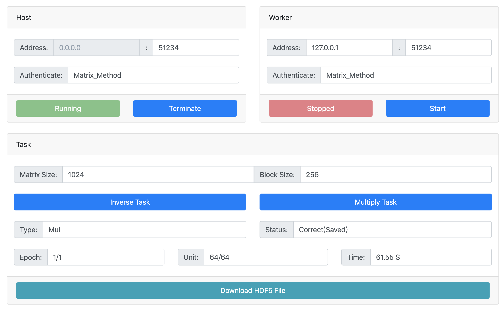

# 分布式矩阵运算

已发布到Docker Hub：https://hub.docker.com/r/wnjxyk/simple_distributed_matrix

使用Python语言编写，测试版本Python3.6。

* `multiprocessing` 实现分布式的任务分配
* `flask` 实现Web控制界面
* `h5py` 实现结果HDF5格式存储
* 支持矩阵乘法与矩阵求逆运算


## 基于Docker的分布式矩阵运算测试

#### Step One : 从镜像新建Docker容器

```shell
docker run -d -it -p 8080:80 matrix python /root/Distributed_Matrix_Method/Distributed.py

docker run -d -it -p 8081:80 --cpus=0.01 matrix python /root/Distributed_Matrix_Method/Distributed.py

docker run -d -it -p 8082:80 --cpus=0.01 matrix python /root/Distributed_Matrix_Method/Distributed.py

docker run -d -it -p 8083:80 --cpus=0.01 matrix python /root/Distributed_Matrix_Method/Distributed.py

docker run -d -it -p 8084:80 --cpus=0.01 matrix python /root/Distributed_Matrix_Method/Distributed.py
```
这里使用Docker新建了5个容器，为了不让分布式的控制节点成为系统的瓶颈，我们把8080端口容器不设置CPU限制，将其他四个DockerCPU使用率限制在0.01个CPU。


#### Step Two : 测试性能

查明8080端口Docker容器在局域网中的IP，然后在Docker宿主浏览器中打开这五个Docker控制页面，进行分布式计算性能测试。


这里我们的控制节点名字叫做`infallible_mestorf`，四个Worker节点的名字叫做`confident_benz`、`stupefied_kirch`、`epic_mahavira`与`compassionate_poitras`。


首先，我们测试一下只使用一个Worker，这里我们启用`compassionate_poitras`。

在控制页面，我们可以看到这个矩阵乘法使用了61.56秒。


然后，我们测试四个Worker一起工作的情况，我们把所有容器都加入到工作中。

在控制页面上，我们可以看到这个矩阵乘法使用了19.86秒，提升非常大。


再测试一下求逆操作，可以看到单个Worker需要使用100秒，而四个Worker只使用了约26秒。


#### Step Three : 正确性测试

控制面板会自动测试结果的正确性，如果显示结果为`Correct`就可以判断结果是正确的。同时系统会讲结果存储为一个HDF5格式的文件，可以点击最下面的按钮进行下载。


## Docker常用指令

### 查看Docker之间的网络组织情况

```shell
docker network inspect bridge
```
### 统计Docker容器使用情况

```shell
docker stats # CPU使用情况
docker ps # 运行中容器列表
docker ps -a  # 所有容器列表
```

### 关闭所有Docker执行进程

```shell
docker stop $(docker ps -a | awk '{ print $1}' | tail -n +2)
```
### 关闭所有Docker容器

```shell
docker rm $(docker ps -a | awk '{ print $1}' | tail -n +2)
```